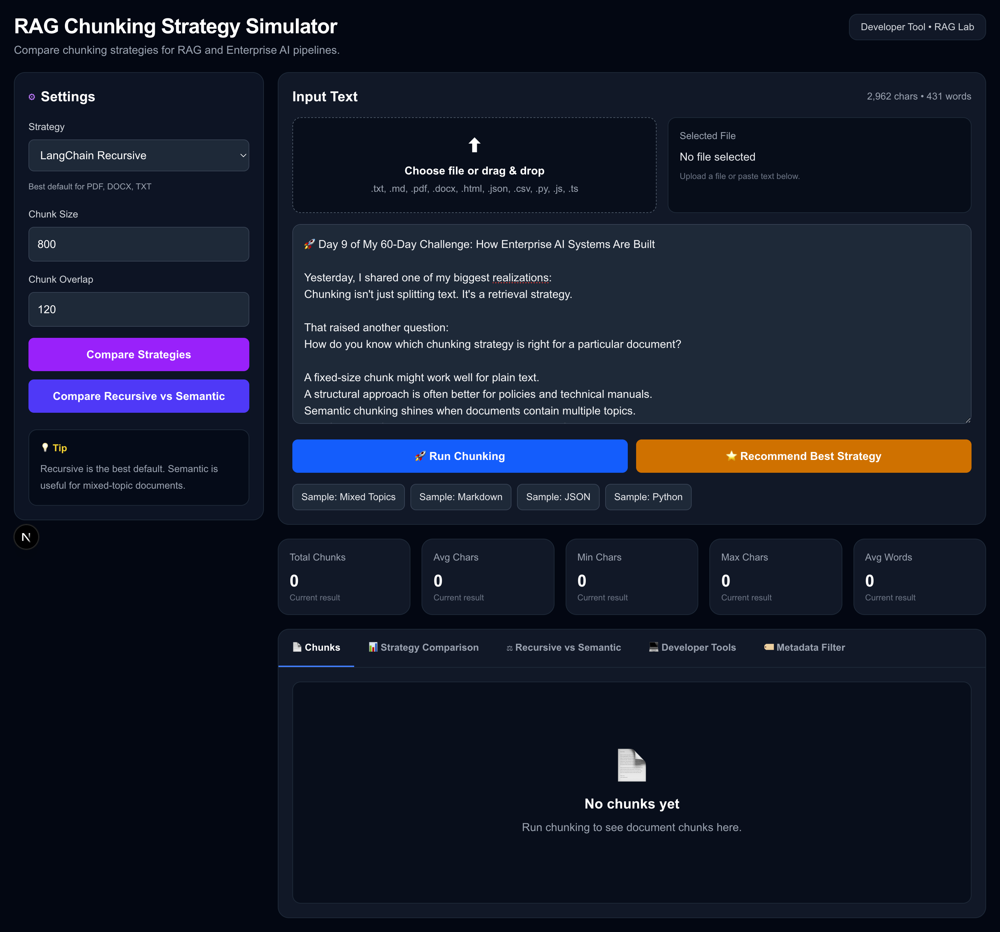
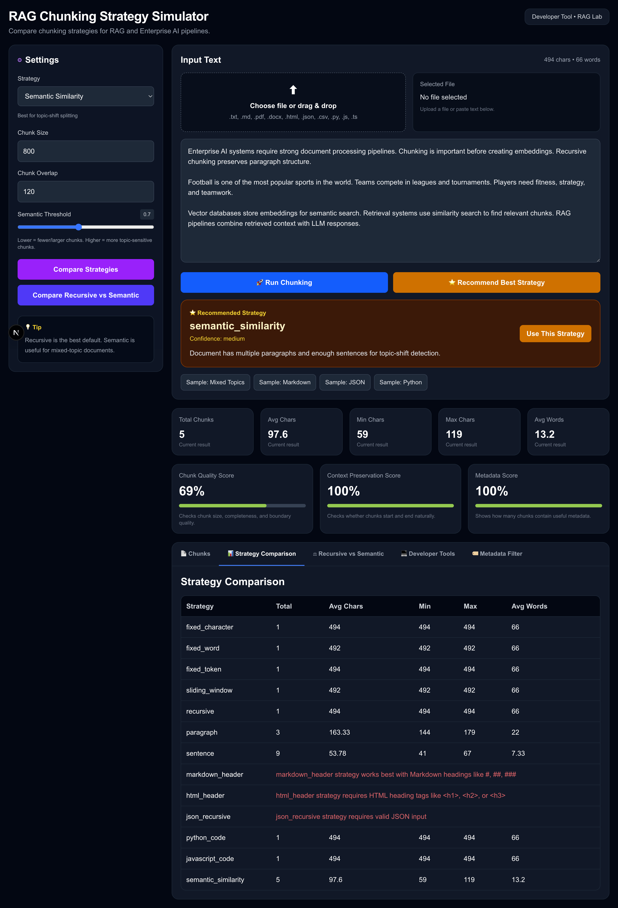
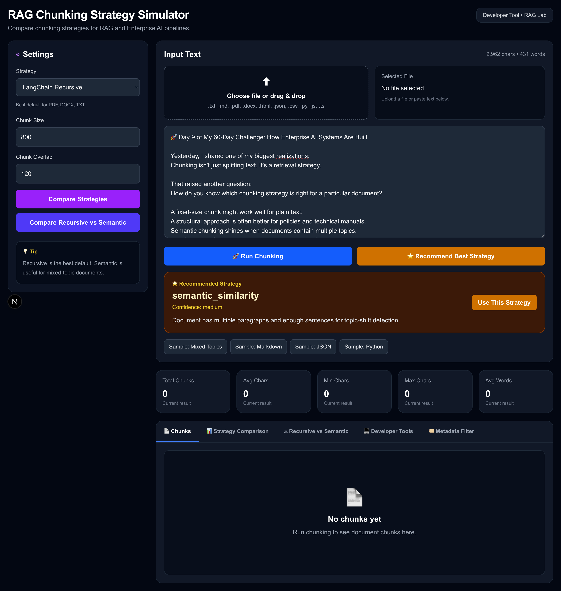
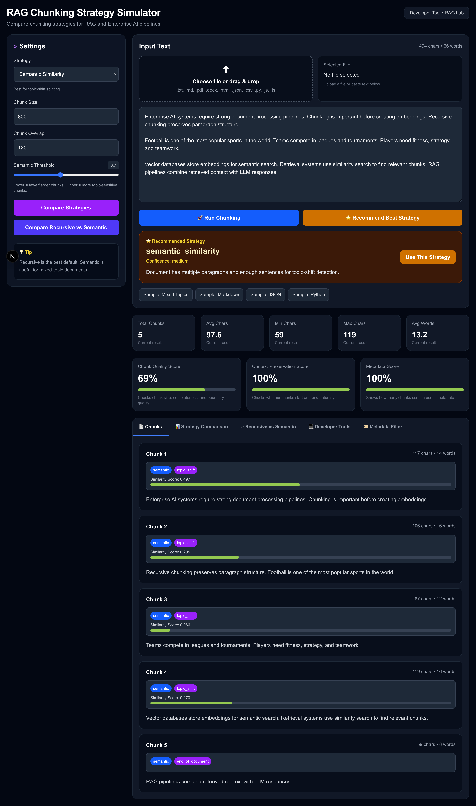
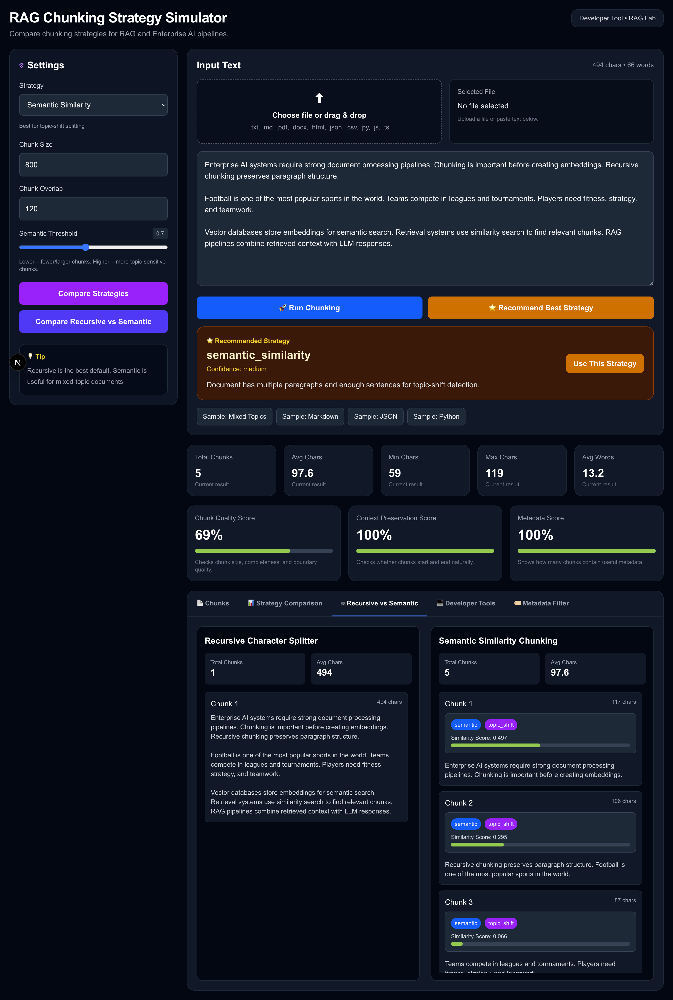

# RAG Chunking Strategy Simulator

> **An interactive Enterprise AI tool to learn, compare, visualize, and evaluate chunking strategies for Retrieval-Augmented Generation (RAG).**


---

## 📖 Overview

Chunking is one of the most important—but often overlooked—steps in a RAG pipeline.

Different document types require different chunking strategies to maximize retrieval quality and LLM response accuracy.

This simulator allows developers, AI engineers, and architects to:

- Compare multiple chunking strategies
- Visualize chunk boundaries
- Evaluate chunk quality
- Explore metadata generated during chunking
- Understand when to use each strategy
- Generate LangChain code snippets
- Benchmark chunking approaches for enterprise AI systems

---

# ✨ Features

## 📚 Supported Chunking Strategies

### Basic

- Fixed Character
- Fixed Word
- Fixed Token
- Sliding Window
- Paragraph
- Sentence

### LangChain

- Recursive Character Splitter
- Markdown Header Splitter
- HTML Header Splitter
- Recursive JSON Splitter
- Python Code Splitter
- JavaScript Code Splitter

### AI-powered

- Semantic Similarity Chunking
  - Sentence Transformers
  - Configurable similarity threshold

---

# 📄 Supported File Types

✅ TXT

✅ Markdown

✅ PDF

✅ DOCX

✅ HTML

✅ JSON

✅ CSV

✅ Python

✅ JavaScript

✅ TypeScript

✅ JSX / TSX

---

# 📊 Analysis Dashboard

After processing a document the simulator displays

- Total Chunks
- Average Characters
- Minimum Chunk Size
- Maximum Chunk Size
- Average Words

---

# 📈 Quality Evaluation

The simulator automatically evaluates every chunking strategy.

### Chunk Quality Score

Evaluates

- Chunk size consistency
- Boundary quality
- Readability

---

### Context Preservation Score

Measures how well context is preserved across chunk boundaries.

---

### Metadata Score

Shows how much useful metadata has been generated.

---

# 🏷 Metadata Visualization

Each chunk can include metadata such as

- Chunk Type
- Break Reason
- Similarity Score
- Language
- Section Information

---

# 🤖 AI Recommendation Engine

The simulator analyzes the document and recommends the most suitable strategy.

| Document | Recommendation |
|-----------|---------------|
| Plain Text | Recursive |
| Markdown | Markdown Header |
| HTML | HTML Header |
| JSON | Recursive JSON |
| Python | Python Code |
| JavaScript | JavaScript Code |
| Multi-topic Text | Semantic Similarity |

---

# ⚖ Strategy Comparison

Compare every chunking strategy using

- Total Chunks
- Average Chunk Size
- Minimum Size
- Maximum Size
- Average Words

---

# 🔄 Recursive vs Semantic Comparison

Visual side-by-side comparison of

- Recursive Character Splitter
- Semantic Similarity Chunker

Compare

- Chunk boundaries
- Metadata
- Similarity
- Chunk sizes

---

# 🛠 Developer Tools

- Export JSON
- Copy Chunks
- Generate LangChain Code
- Copy LangChain Code

---

# 🧪 Testing

Unit tests cover

- Fixed Character Chunker
- Fixed Word Chunker
- Sliding Window Chunker
- Paragraph Chunker
- Sentence Chunker
- Recursive Chunker
- Markdown Chunker
- HTML Chunker
- JSON Chunker
- Python Chunker
- JavaScript Chunker
- Semantic Chunker

Run all tests

```bash
cd backend

source venv/bin/activate

pytest -v
```

---

# 🏗 Architecture

```
                  +---------------------+
                  |    Next.js UI       |
                  +----------+----------+
                             |
                             |
                  REST API (FastAPI)
                             |
      +----------------------+----------------------+
      |                                             |
      |                                             |
Chunk Service                              Upload Service
      |
      |
+---------------------------+
| Chunking Strategy Layer   |
+---------------------------+
| Fixed                     |
| Recursive                 |
| Sliding                   |
| Paragraph                 |
| Sentence                  |
| Markdown                  |
| HTML                      |
| JSON                      |
| Code                      |
| Semantic                  |
+---------------------------+
             |
             |
Evaluation Engine
             |
             |
Metadata + Statistics
             |
             |
JSON Response
```

---

# 📂 Project Structure

```
rag-chunking-simulator/

├── backend/
│   ├── app/
│   │   ├── api/
│   │   ├── chunkers/
│   │   ├── services/
│   │   ├── utils/
│   │   └── main.py
│   │
│   ├── tests/
│   ├── requirements.txt
│   └── pytest.ini
│
├── frontend/
│   ├── app/
│   ├── components/
│   ├── public/
│   └── types/
│
└── README.md
```

---

# 🚀 Installation

## Backend

```bash
cd backend

python -m venv venv

source venv/bin/activate

pip install -r requirements.txt

uvicorn app.main:app --reload
```

Backend

```
http://localhost:8000
```

Swagger

```
http://localhost:8000/docs
```

---

## Frontend

```bash
cd frontend

npm install

npm run dev
```

Frontend

```
http://localhost:3000
```

---

# 📸 Screenshots

<table>
<tr>
<td align="center">
<b>Dashboard</b><br>

</td>

<td align="center">
<b>Strategy comparison</b><br>

</td>
</tr>

<tr>
<td align="center">
<b>AI recommendation</b><br>

</td>

<td align="center">
<b>Chunking</b><br>

</td>
</tr>

<tr>
<td align="center">
<b>Recursive vs Sementic comparison</b><br>

</td>

<td align="center">
<b>Developer Tool</b><br>

</td>
</tr>
</table>

---

# 🗺 Roadmap

## ✅ Completed

- Multiple chunking strategies
- Semantic chunking
- File upload
- Strategy comparison
- Recursive vs Semantic comparison
- Recommendation engine
- Metadata visualization
- Chunk quality metrics
- Export JSON
- LangChain code generation
- Unit tests

## 🚧 Planned

- Retrieval Simulator
- Embedding Visualization
- Hybrid Chunking
- LLM-based Chunking
- Parent–Child Chunking
- RAPTOR Chunking
- Table-aware Chunking
- OCR-aware Chunking
- Multi-document Benchmarking
- Docker
- GitHub Actions CI/CD
- Vector Database Integration
- RAG Evaluation Dashboard

---

# 🤝 Contributing

Contributions, ideas, and feature requests are welcome.

1. Fork the repository
2. Create a feature branch
3. Commit your changes
4. Open a Pull Request

---

# 📜 License

MIT License

---

# 👨‍💻 Author

**Jay Ram Singh**

AI Engineer | Enterprise AI Architect | RAG & LLM Systems

- GitHub: https://github.com/code-jay
- LinkedIn: https://www.linkedin.com/in/jayram/

---

⭐ **If you find this project useful, consider giving it a Star!**